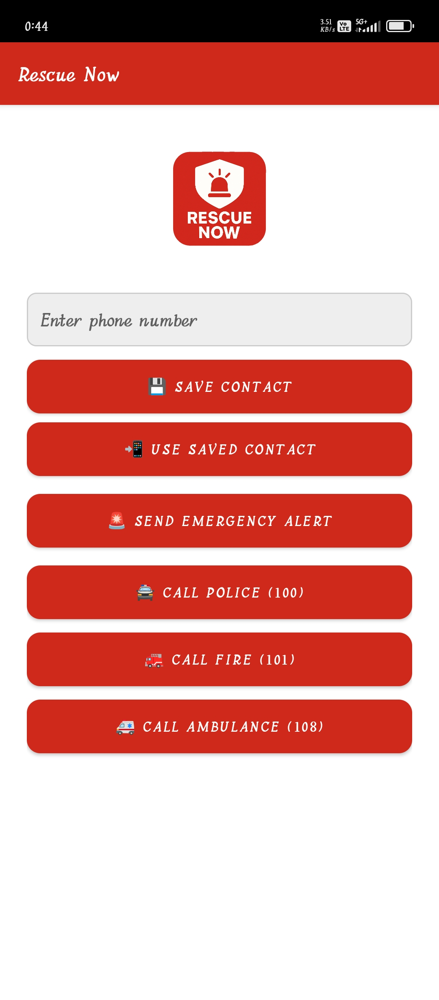
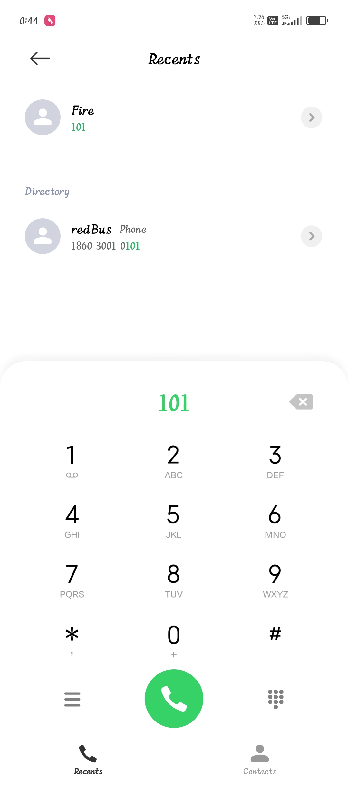
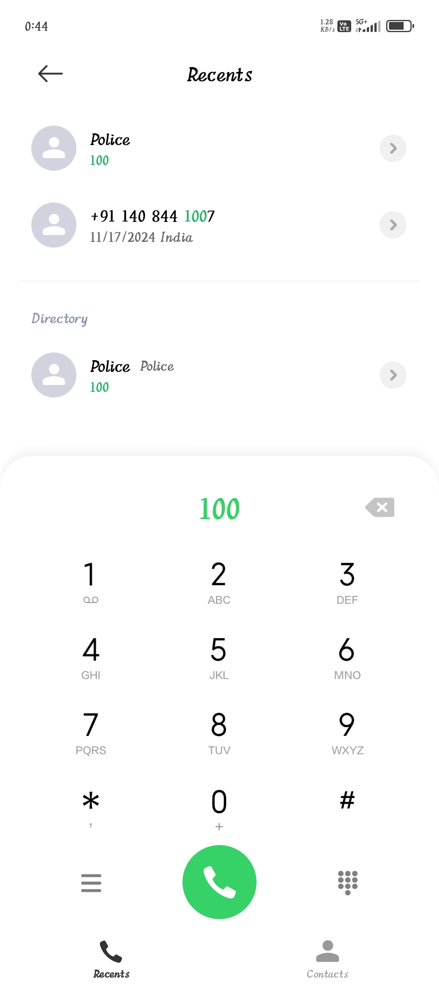
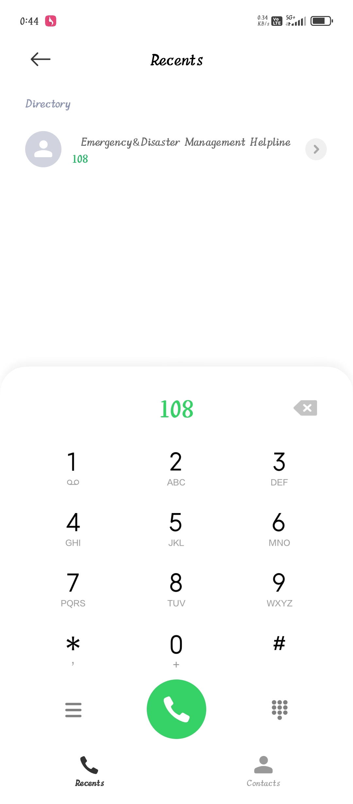
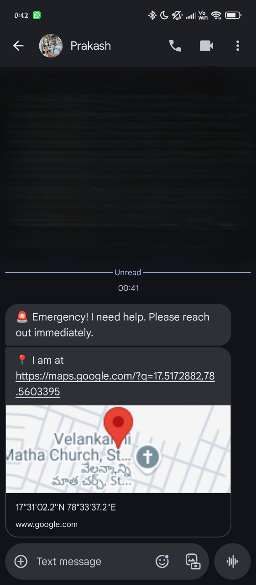
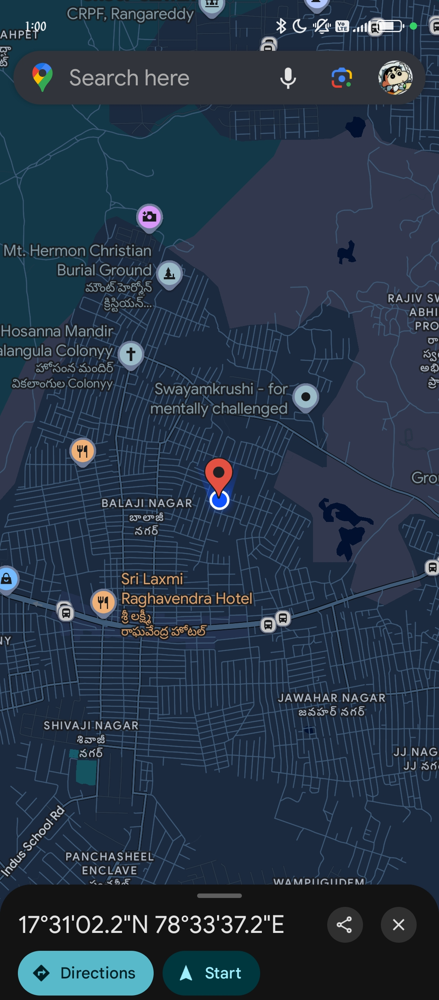

 # RescueNowApp

**RescueNowApp** is an Android emergency alert application designed especially for rural and urban users to send quick emergency alerts with location via SMS and Firebase. It allows users to trigger emergency actions using buttons or volume keys and helps notify Police, Ambulance, Fire, or a saved contact person.

---

## Features

- 📍 Real-time GPS Location Sharing
- 🔘 Emergency Triggers for:
  - Police
  - Ambulance
  - Fire Service
  - Contact Person (Custom)
- 📤 Emergency SMS with Google Maps Location Link
- 📡 Firebase Integration for Alert Logging
- 🔊 Volume Button Trigger (Background Service)
- ✅ Supports Android 13, 14, and 15 (API 33–34)
- 🔐 Runtime Permissions Handling (SMS, Location, Notifications)

---

## 🛠Technologies Used

- Kotlin
- Android Studio (AppCompat + XML UI)
- Firebase Realtime Database / Cloud Messaging
- Android Location Services
- Foreground Services
- SMS Manager

---

## Getting Started

### Prerequisites

- Android Studio (Giraffe, Hedgehog, or Meerkat recommended)
- Android SDK 33–34
- Firebase project setup (optional for full features)

### Steps

1. **Clone the Repo**
   ```bash
   git clone https://github.com/swayamprakashm/RescueNowApp.git


2. **Open in Android Studio**

3. **Run on Device or Emulator**

---

## Permissions Required

Make sure the app requests and grants the following permissions:

* `ACCESS_FINE_LOCATION`
* `SEND_SMS`
* `POST_NOTIFICATIONS` (Android 13+)
* `FOREGROUND_SERVICE_LOCATION` (Android 14+)

---

## Screenshots

### App Logo:


### App Home Screen:


### Dialer Screens via App (101, 100, 108):
  

### App Message Output:


### App Map Layout:


---

## Future Enhancements

* Emergency alert history
* Voice command activation
* Local language support
* SOS signal with siren

---

## Developed By

**M. Swayam Prakash**

Github: [https://github.com/swayamprakashm](https://github.com/swayamprakashm)

---

## License

This project is licensed under the MIT License. 
